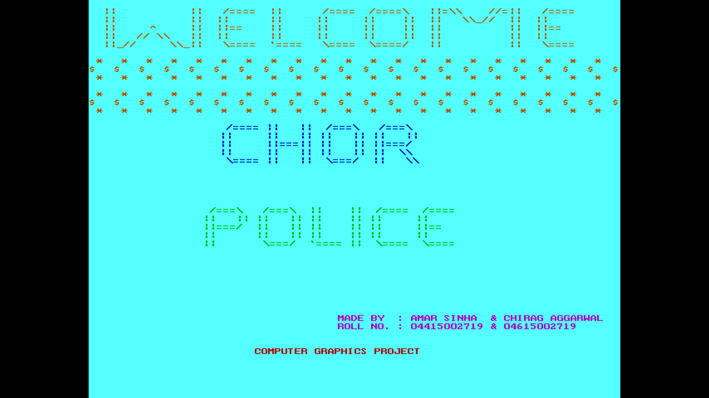
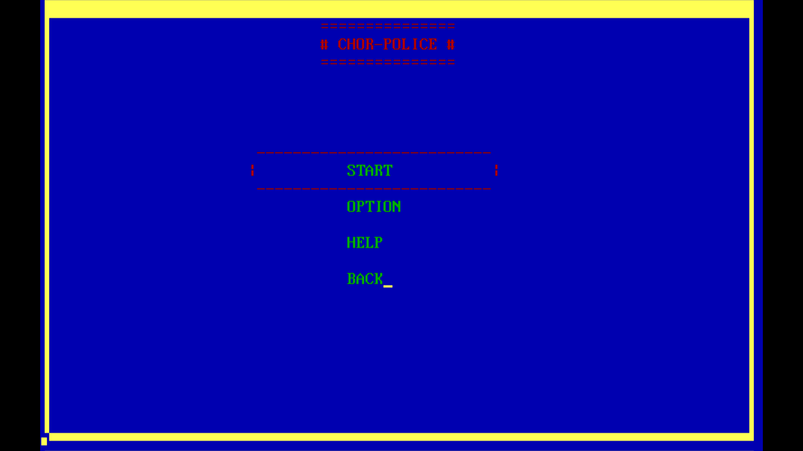
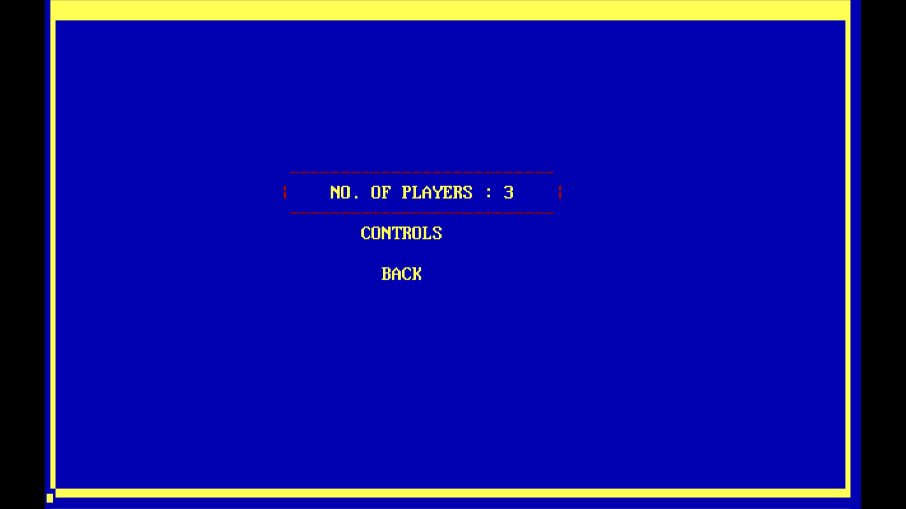
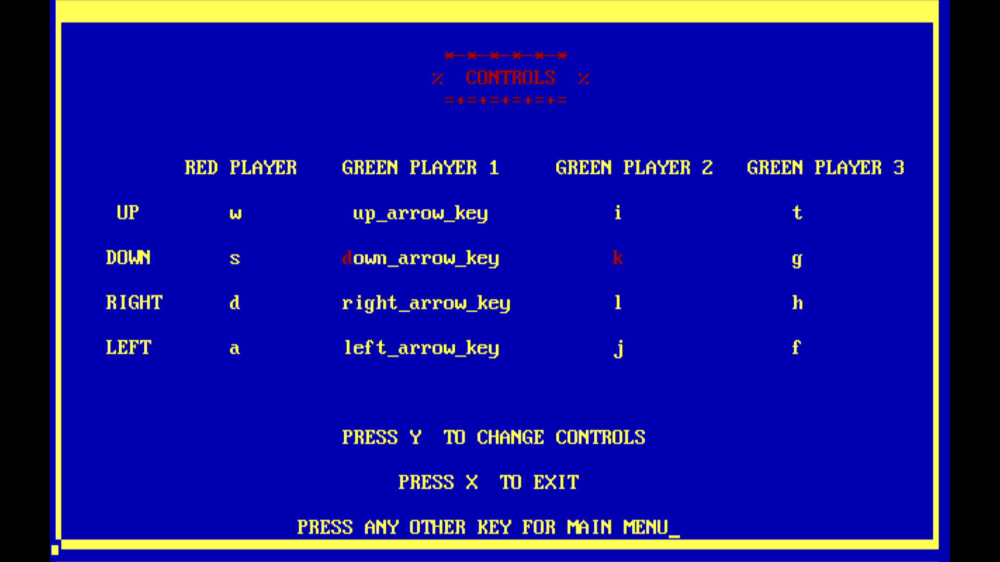
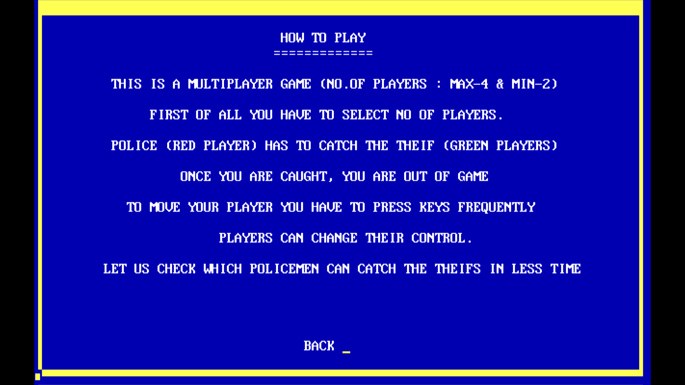
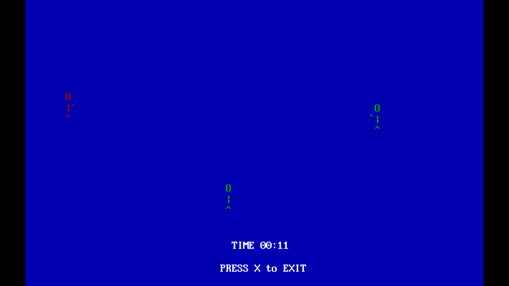
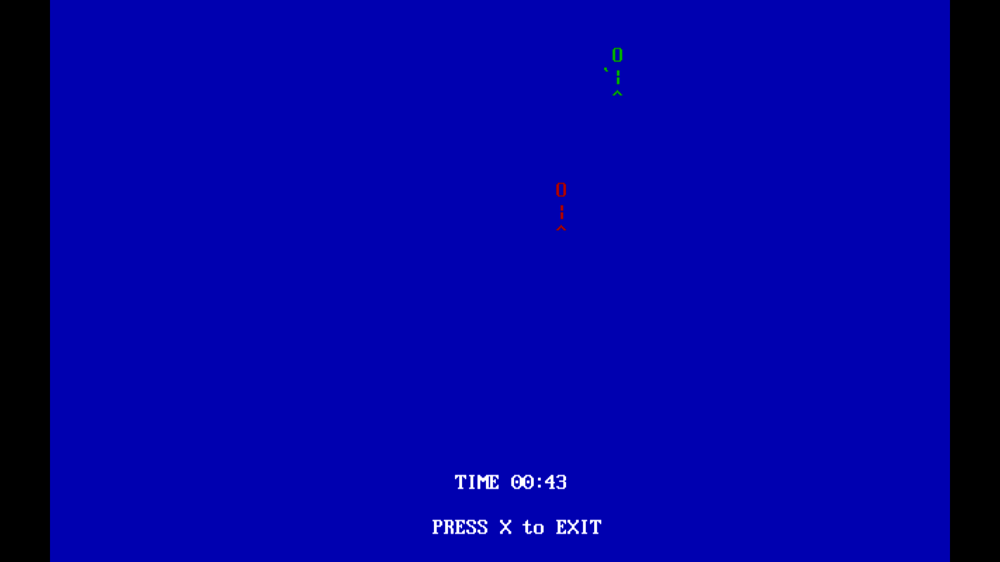
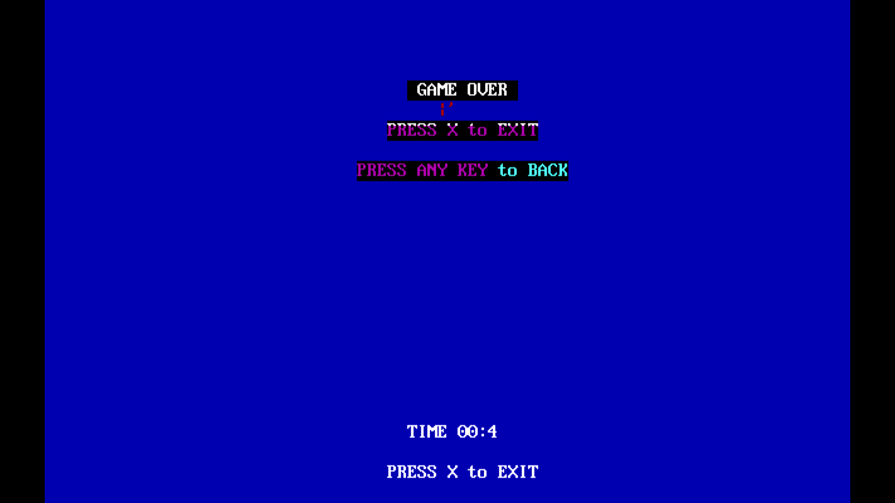

# Computer-Graphics-Project
    This is the Code Base of the Computer Graphics Project written in C plus plus .

# Some Screenshots
## Welcome Page

## Start Menu

## Options

## Controls

## Help

## 3 Player Game 

## 2 Player Game

## Game Over

# MADE BY 
- Amar Sinha 
- Chirag Aggarwal
